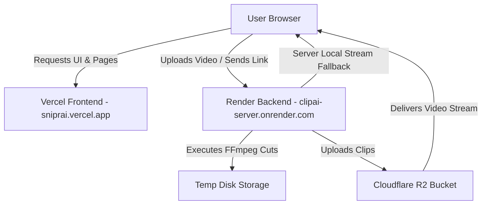

# Snipr AI — Full Technical & System Documentation

Welcome to the official technical documentation for **Snipr AI** (formerly ClipAI). This document covers the architecture, tech stack, deployment configurations, features, and SEO infrastructure of the project.

---

## 📑 Executive Summary

- **Project Name:** Snipr AI
- **Live Frontend URL:** [https://sniprai.vercel.app](https://sniprai.vercel.app)
- **Live Backend API:** [https://clipai-server.onrender.com](https://clipai-server.onrender.com)
- **GitHub Repository:** [Aniq854/ai-video-clipper](https://github.com/Aniq854/ai-video-clipper)
- **Primary Function:** A free online AI video clipping tool that transforms long-form videos (podcasts, webinars, YouTube videos) into short 9:16 vertical clips for TikTok, Instagram Reels, and YouTube Shorts in ~3 seconds with zero watermarks.

---

## 🛠️ Complete Technology Stack

### 1. Frontend Application
- **Framework:** Next.js 14 (App Router Architecture)
- **Language:** JavaScript (ES6+ / Node.js)
- **UI Library:** React 18
- **Styling:** Custom Vanilla CSS with CSS Variables (`globals.css`), Dark Mode Glassmorphism Theme, Responsive CSS Grid
- **HTTP Client:** Axios (with chunked upload retry logic)
- **Hosting Platform:** **Vercel** (Global Edge Network)

### 2. Backend Processing Server
- **Runtime:** Node.js (v18 / v20)
- **Framework:** Express.js
- **Media Processing Core:** FFmpeg (`fluent-ffmpeg`, `@ffmpeg-installer/ffmpeg`, `@ffprobe-installer/ffprobe`)
- **YouTube Downloading Engine:** `yt-dlp` (automatic self-updating binary from GitHub releases with client rotation fallback)
- **File Upload Handler:** Multer (with disk storage & `.mp4` file extension enforcement)
- **Cloud Object Storage:** Cloudflare R2 via AWS S3 SDK (`@aws-sdk/client-s3`)
- **Hosting Platform:** **Render.com** (Linux Container Service)

### 3. Storage & CDN Infrastructure
- **Storage Provider:** Cloudflare R2 Object Storage
- **Bucket Name:** `clipper-media-storage`
- **CDN Features:** Global edge caching, zero egress fees, fast clip downloads

---

## 🚀 Deployment Overview



### Frontend Deployment (Vercel)
- **Repository Branch:** `main`
- **Build Command:** `next build` (inside `frontend/`)
- **Output Directory:** `.next`
- **Environment Variables:**
  - `NEXT_PUBLIC_API_URL` = `https://clipai-server.onrender.com`

### Backend Deployment (Render.com)
- **Service Name:** `clipai-server`
- **Environment:** Node.js
- **Build Command:** `npm install` (inside `clipserver/`)
- **Start Command:** `node server.js`
- **Environment Variables:**
  - `PORT` = `4000`
  - `R2_ACCOUNT_ID` = `[YOUR_R2_ACCOUNT_ID]`
  - `R2_ACCESS_KEY_ID` = `[YOUR_R2_ACCESS_KEY_ID]`
  - `R2_SECRET_ACCESS_KEY` = `[YOUR_R2_SECRET_ACCESS_KEY]`
  - `R2_BUCKET_NAME` = `clipper-media-storage`

---

## ⚡ Core Features & Technical Implementation

### 1. Chunked Video Uploader
To bypass Render.com's 30-second HTTP request timeout on large video uploads (50MB–500MB+), the frontend splits files into **3MB chunks**:
- Endpoint: `POST /api/upload/chunk`
- Re-assembles chunks into a single `.mp4` file on the server once all chunks arrive.
- Auto-retries failed chunks up to 3 times for flaky mobile connections.

### 2. YouTube Video Clipping Pipeline
- Endpoint: `POST /api/youtube`
- Uses `yt-dlp` with `--download-sections "*start-end"` to download only the requested timestamp range instead of the whole video.
- Implements **Player Client Rotation** (`android` ➔ `ios` ➔ `mweb` ➔ `web`) to bypass YouTube bot detection & 429 rate limits.

### 3. FFmpeg Video Trimming & Cropping
- **Stream Copy Mode:** Uses `-c copy` where keyframes align for instant 3-second cuts.
- **Smooth H.264 Re-encode Fallback:** Resets timestamps (`setpts=PTS-STARTPTS`), enforces 30fps CFR, 1-second keyframe interval, and zero scene-cut threshold for smooth playback without freeze frames.
- **Aspect Ratio Cropping:**
  - `9:16` (Shorts / Reels / TikTok): `crop='min(iw,ih*9/16)':'min(ih,iw*16/9)'`
  - `1:1` (Square): `crop='min(iw,ih)':'min(iw,ih)'`
  - `16:9` (Original Widescreen)

### 4. Dynamic Multi-Clip Generator
Automatically calculates the number of viral clips to generate based on source video length:
- `< 30s`: 1 clip
- `30s – 90s`: 2 clips
- `1.5m – 5m`: 3 clips
- `5m – 15m`: 4–5 clips
- `15m – 30m`: 6–8 clips
- `30m+`: 10–12 clips

---

## 🔍 SEO & AdSense Infrastructure

### 1. Page Hierarchy & Content Strategy
- **Homepage (`/`):** Clean single `H1` tag (`Free AI Video Clipper – Turn Long Videos into Viral Shorts`), H2/H3 structured content, feature cards, and Interactive Tool box.
- **Blog Engine (`/blog`):** 20 comprehensive, 1000+ word original articles with category badges, reading time, and internal links pointing back to Snipr AI.
- **Legal & Compliance Pages:**
  - Privacy Policy: `/privacy`
  - Terms of Service: `/terms`
  - About Us: `/about`
  - Contact Us: `/contact`

### 2. Search Engine Indexing & Validation
- **Dynamic Sitemap:** Generated via `frontend/src/app/sitemap.js` -> Accessible at `https://sniprai.vercel.app/sitemap.xml` (Includes all 25 site URLs).
- **Robots Rules:** Generated via `frontend/src/app/robots.js` -> Accessible at `https://sniprai.vercel.app/robots.txt`.
- **Structured Data:** JSON-LD `FAQPage` schema on homepage for Google Rich Snippets.
- **Google Search Console Verification:** Active meta tag in `layout.js`:
  `9NXg-dFTqTBZ1ug-Dx1ifzCUK1CCSfzoTKpOuhoM7-Y`

---

## 📁 Repository Structure

```
Clipping Tool/
├── DOCUMENTATION.md                  # This documentation file
├── clipserver/                       # Node.js Express Backend
│   ├── server.js                     # Main server entrypoint (Endpoints, FFmpeg, R2)
│   ├── package.json                  # Dependencies (express, fluent-ffmpeg, aws-sdk)
│   └── temp/                         # Temporary video processing folder (Auto-cleaned every 10 min)
└── frontend/                         # Next.js 14 App Router Frontend
    ├── src/
    │   ├── app/
    │   │   ├── layout.js             # Root layout with Navbar, Footer & GSC Verification
    │   │   ├── page.js               # Homepage (Tool + SEO Content + FAQ Schema)
    │   │   ├── globals.css           # Styling Tokens & Glassmorphism Design System
    │   │   ├── sitemap.js            # Dynamic Sitemap.xml Generator (25 URLs)
    │   │   ├── robots.js             # Dynamic Robots.txt Generator
    │   │   ├── blog/                 # Blog Index & 20 Full SEO Articles
    │   │   │   ├── page.js           # Blog grid page
    │   │   │   └── [slug]/page.js    # Dynamic Article Template
    │   │   ├── about/page.js         # About Us Page
    │   │   ├── contact/page.js       # Contact Us Page
    │   │   ├── privacy/page.js       # Privacy Policy Page
    │   │   └── terms/page.js         # Terms of Service Page
    │   ├── components/               # React Components (ClipCard, Header, etc.)
    │   └── services/api.js           # API Client with chunked upload handler
    └── package.json                  # Frontend dependencies (next, react, axios)
```

---

## 🔒 Security & Data Hygiene
- **Automatic File Cleanup:** All temporary input videos and output clips on the backend server are automatically deleted from disk every 10 minutes by a background process.
- **Cloud Storage Expiry:** Cloudflare R2 clip files expire automatically after 24 hours.
- **Zero Account Footprint:** No user passwords or personal identifiable information (PII) are stored in any database.

---

*Documentation last updated: August 6, 2026*
